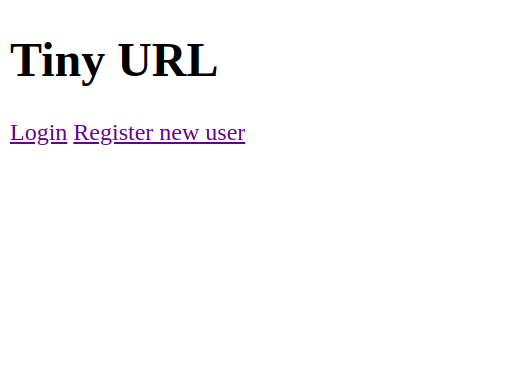
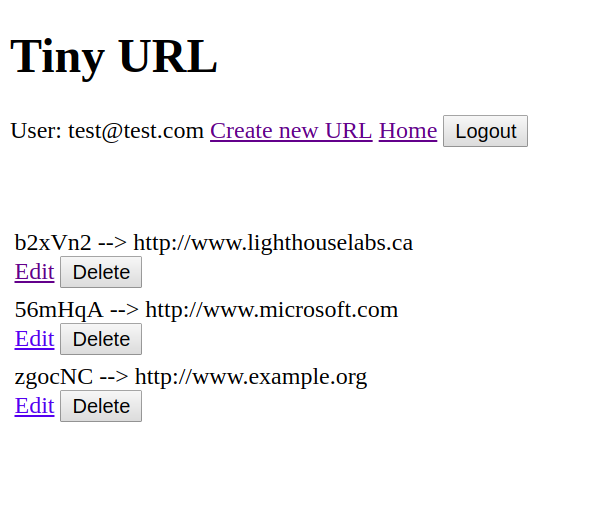
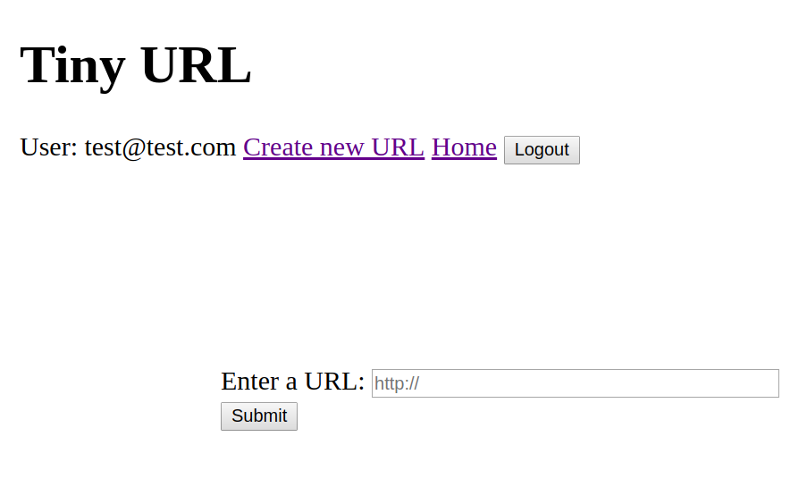

# TinyApp

TinyApp is a full stack web application built with Node and Express which allows users to shorten long URLs.

## Final Product

* **Main Page** 

* **User's Page**

* **Creating New shortURLs**

## Dependencies
* bcrypt
* body-parser
* cookie-session
* ejs
* express

## Getting started
- All dependencies will be installed using the command `npm install` - it also runs the Application.
- Another way to run is by the command `node express_server.js`.

## Improvements
- A better interface with CSS
- Buttons to return to some pages